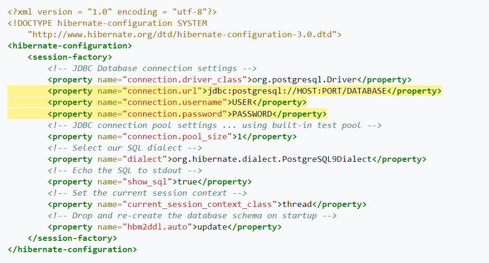

## Movie App
Simple app practice Spring
### Built
* Java
* Spring
## Getting Started
### Prerequisities
First, you will got to maven.apache.org. Click on the download link. Then you will select the operating system that is on your PC. 
Now you will download the Binary zip archive for the latest version of maven. Then you will unzip it into Program Files, 
and from there you follow the Path instructions from before making sure the file route ends in the bin folder.
Now, let’s ensure that you have successfully installed Maven on your development machine. 
Run mvn on the command line as you see below. You should see the following output (or something that looks similar).

`mvn --version`
```
Maven home: C:\Program Files\apache-maven-3.8.6
Java version: 17.0.4, vendor: Oracle Corporation, runtime: C:\Program Files\Java\jdk-17.0.4
Default locale: en_US, platform encoding: Cp1252
OS name: "windows 10", version: "10.0", arch: "amd64", family: "windows"
```
After opening the template, right-click on the pom.xml file and click add as Maven project

### Intallation
1. Clone the repo 
```
https://github.com/edgarefigueroa/java-proj-3.git
```
2. Open SpringmvcApplication.java to run project then visit http://localhost:8080

3. To setup Hibernate, we first need to setup a Postgres database. Use Heroku and Heroku Postgres.
Navigate to https://www.heroku.com/ and login. Create a new project on Heroku
After you have created the new project, click on the name of the project so that it takes you to the project overview page.

4. Click on the Configure Add-ons link and search for Heroku-Postgres and add it to the project by clicking on “Submit Order Form” on the pop up.
   At this point you can click on the “Heroku Postgres” link and it will redirect you to the page that shows all the information regarding the database.
   To see the credentials needed to connect to the Database click on the “Settings” tab and navigate to the “Database Credentials” section. 
   On the right hand side of the screen there is a button labeled “View Credentials” which drops down the section and shows the credentials.
5. In the resources directory hibernate.cfg.xml change the following code into that file (the highlighted lines are important for the next bullet point)

* In Heroku Postgres, go to the settings and open the database credentials to find the following information and insert it into your xml file:

  * Replace HOST with the Host info

  * Replace DATABASE with the Database info

  * Replace USER with the User info

  * Replace PASSWORD with the Password info

## Project Usage
Find the best Movie
Vote for your favorite movie
Add a movie